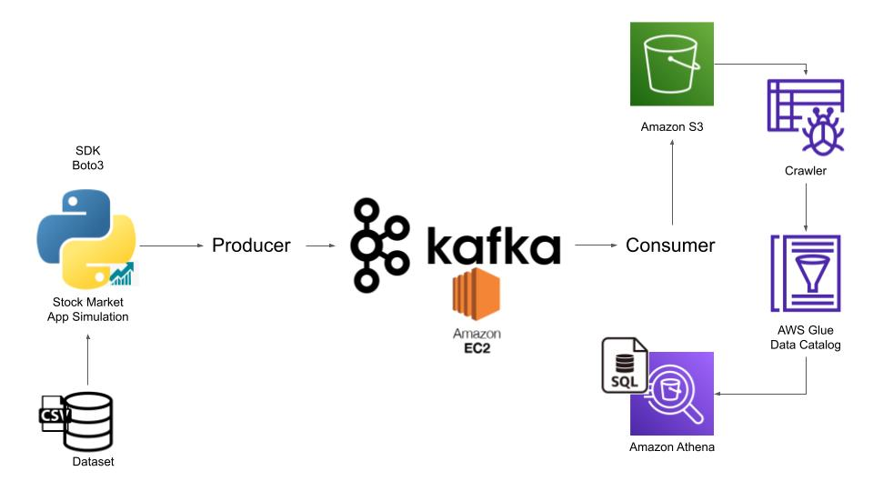

# **Stock Market Real-Time Data Analysis Using Kafka and AWS**

## **Project Overview**

This project demonstrates **real-time stock market data streaming and analysis** using **Apache Kafka** for event streaming and **AWS services** (S3, Glue, and Athena) for data storage and querying. It simulates real-time stock data processing from a static dataset, enabling **event-driven architecture** for financial analytics.

---

## **Architecture Overview**

!

1. **Stock Market Data Simulation**  
   - A static **CSV dataset** is used to simulate real-time stock market data.  
   - A **Python script (Kafka Producer)** reads the dataset and streams records to Kafka.  

2. **Kafka for Real-Time Streaming**  
   - **Kafka Producer** sends stock data to a Kafka topic (`demo_test`).  
   - **Kafka Broker** (running on Amazon EC2) manages message distribution.  
   - **Kafka Consumer** listens to the topic and processes the incoming stock data.  

3. **AWS Data Storage & Processing**  
   - The **Kafka Consumer** writes processed stock data to an **Amazon S3** bucket.  
   - **AWS Glue** crawler scans and catalogs the data for structured querying.  
   - **Amazon Athena** allows querying stock data using **SQL-like queries**.  

---

## **Technologies Used**

- **Apache Kafka** – Distributed event streaming  
- **AWS S3** – Scalable storage for stock market data  
- **AWS Glue** – Schema discovery & ETL pipeline  
- **AWS Athena** – SQL-based querying on S3 data  
- **Python** – Data processing (Producer & Consumer)  
- **Boto3** – AWS SDK for Python  
- **Pandas** – Data handling and transformation  

---

## **Project Setup & Execution**

### **1. Prerequisites**
- **Python Installed** (Python 3.x recommended)  
- **AWS Account** with access to S3, Glue, and Athena  
- **Kafka installed on an AWS EC2 instance**  

### **2. Setting Up Kafka on EC2**
Follow the detailed **(kafkasetup_ec2.txt)**.

### **3. Running the Kafka Producer**
```bash
python3 kafka_producer.py
```
- Reads stock data from `data/indexProcessed.csv`  
- Streams data to Kafka topic **every second**  

### **4. Running the Kafka Consumer**
```bash
python3 kafka_consumer.py
```
- Listens to the Kafka topic (`demo_test`)  
- Saves stock data as JSON files in the **S3 bucket**  

### **5. Querying Data with AWS Athena**
- Create an **AWS Glue Crawler** to register data in Glue Data Catalog.  
- Use **Amazon Athena** to perform SQL queries on stock data.  

---

## **Code Overview**

### **Kafka Producer (`kafka_producer.py`)**
- Reads stock data from CSV file  
- Publishes messages to Kafka topic `demo_test`  
- Uses JSON serialization and **1-second interval** for streaming  

### **Kafka Consumer (`kafka_consumer.py`)**
- Listens to Kafka topic and consumes stock data  
- Stores data in **Amazon S3** as JSON files  
- Uses `boto3` and `s3fs` for AWS interaction  

---

## **Key Features & Benefits**

**Real-Time Data Processing** – Simulates live stock market data  
**Scalable Event Streaming** – Apache Kafka ensures high throughput  
**AWS Data Pipeline** – Seamless integration with S3, Glue, and Athena  
**SQL-Based Analytics** – Query large datasets efficiently with Athena  
**Fault-Tolerant & Reliable** – Kafka’s distributed architecture ensures durability  
 
---
## Acknowledgments
- Special thanks to [@darshilparmar](https://github.com/darshilparmar) for this project.